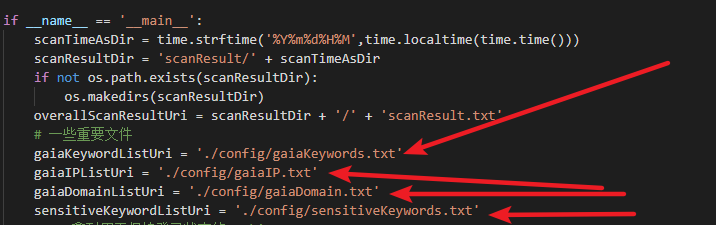
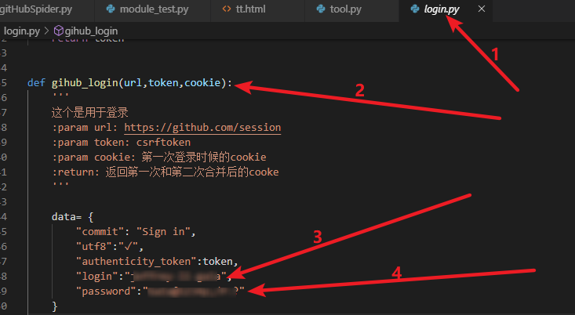
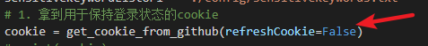

# 文件说明

> - config 目录下是一些必填的配置性文件
> - `gaiaIP.txt` : 公司服务器的IP。每行一个IP地址
> - `gaiaDomain.txt`: 公司一些服务的域名。每行一个域名。本版程序暂时未用到
> - `gaiaKeywords.txt`:能够识别为本公司的一些标志性关键字
> - `sensitiveKeywords.txt`:一些比较敏感的关键词，如用户名、密码之类的

# 使用说明

- `pip install -r requirements.txt`
- 按照**文件说明**填写一些内容
  - 
- 填写自己github上的用户名和密码
  - 
  - 注：在新机器上第一次登录时需要有验证码
  - 因而第一次需要先实际在浏览器中登录，并填写验证码
  - 之后，方可继续正常执行
- 如果需要更新存储的Cookie值，则需要在gitHubSpider.py文件中的`get_cookie_from_github(refreshCookie=False)`False改为True
  - 
- 之后运行即可

# 版本说明

- v 1.0.0
  - 缺少多线程支持
  - 缺少随机代理IP支持
  - 缺少随机UA支持
  - 现只支持在GitHub上进行源码扫描
  - 权重算法不细致，需要更新
  - 异常处理不完善
  - 源码泄露扫描结果展示不友好
- v 1.0.1 
  - 修改权重算法
- v 1.0.2 
  - 删除冗余文件夹（即删除不包含敏感信息的用户目录）
- v 1.0.3 
  - 使用递归思想查找保存用户某仓库下的所有文件链接
- v 1.0.4 
  - 优化：查找文件时，遇见图片、音频、pdf等格式的文件即停止
- v 1.0.5 【待做】
  - 完善扫描结果展示界面
- v 1.1.0 【待做】
  - 增加随机UA支持
- v 1.2.0 【待做】
  - 增加随机代理IP支持
- v 1.3.0 【待做】
  - 增加redis|mongodb数据库缓存支持
- v 1.4.0 【待做】
  - 增加图形界面操作展示
- v 2.0.0 【待做】
  - 增加CSDN代码扫描
- v 3.0.0 【待做】
  - 增加oschina代码扫描
- v 4.0.0 【待做】
  - 增加gitlab代码扫描